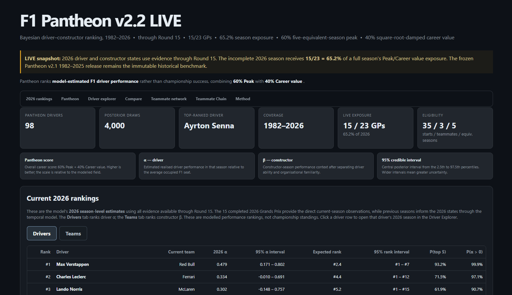

# The F1 Pantheon

### A Bayesian ranking of Formula One driver performance, 1982-present

The F1 Pantheon is a statistical model for comparing Formula One drivers across eras. Rather than ranking drivers by championship points, wins or other career achievements, the Pantheon estimates **driving performance**, separating it from constructor performance and team familiarity.

The final **Pantheon score** balances a driver's highest-performing seasons with sustained positive performance across their career.

> **Current release:** Pantheon v2.2 LIVE - 2026 Round 15  
> **Coverage:** 1982-2026  
> **2026 season exposure:** 15/23 Grands Prix (65.2%)



## Current Pantheon

| Rank | Driver | Pantheon score |
|---:|---|---:|
| 1 | Ayrton Senna | 96.4 |
| 2 | Michael Schumacher | 93.4 |
| 3 | Max Verstappen | 77.4 |
| 4 | Fernando Alonso | 65.9 |
| 5 | Nigel Mansell | 62.6 |
| 6 | Alain Prost | 62.1 |
| 7 | Lewis Hamilton | 59.3 |
| 8 | Nico Rosberg | 49.5 |
| 9 | Rubens Barrichello | 46.0 |
| 10 | Kimi Räikkönen | 45.3 |

The complete ranking, posterior uncertainty, season-by-season driver estimates, current driver and constructor rankings, teammate comparisons and interactive teammate network are available in the dashboard.

The Pantheon score is a **relative model score**, not a percentage or probability.

---

## What does Pantheon measure?

The central quantity in the model is a latent driver-season state,

$$
\alpha_{i,t},
$$

which represents the model's estimate of driver $i$'s **on-track performance in season $t$** relative to the average occupied Formula One seat in that season.

For modern seasons, this is identified primarily using:

- same-lap race pace;
- timed qualifying performance;
- direct teammate contrasts;
- whole-field team-level information;
- temporal information connecting a driver's adjacent seasons.

The model simultaneously estimates a constructor-season effect,

$$
\beta_{c,t},
$$

so that driver performance is separated, as far as the available evidence permits, from the performance of the car.

A team-familiarity term additionally accounts for the effect of a driver becoming familiar with a team over time.

---

## Pantheon score

Career rankings combine two components:

$$\mathrm{Pantheon\ Score} = 0.60 \times \mathrm{Peak} + 0.40 \times \mathrm{Career\ Value}$$

### Peak

Peak measures performance across a driver's **best five seasons**.

The incomplete 2026 season contributes only its completed fraction of a season.

At the current Round 15 snapshot,

$$
f_{2026}=\frac{15}{23}=0.6522.
$$

If 2026 enters a driver's five-season peak window, it therefore occupies 0.6522 of one season, with the remaining filled by the next-best completed season.

### Career value

Career value rewards sustained above-average performance:

$$
S_i = \sum_t \max(0,\alpha_{i,t}),
$$

followed by square-root damping,

$$
C_i=\sqrt{S_i}.
$$

This prevents career length alone from overwhelming peak performance whilst still rewarding drivers who sustain positive performance over many seasons.

For the incomplete 2026 season, positive career surplus is weighted by the same $15/23$ exposure factor.

Peak and Career value are independently normalised within every posterior draw before being combined.

---

## Model

Pantheon is a joint Bayesian driver-constructor model.

### Modern era: 1996-present

Modern race and qualifying data are transformed into both **within-team contrasts** and **team-level observations**.

The likelihood includes:

- race-pace teammate contrasts;
- race-pace team levels;
- qualifying common-session teammate contrasts;
- Q1 team levels.

Heavy-tailed Student-$t$ likelihoods are used to reduce sensitivity to unusual observations.

Driver ability evolves through time using a state-space structure, allowing information to be shared between adjacent seasons without assuming that a driver's performance is constant throughout their career.

Constructor effects are estimated separately for each season.

### Historical era: 1982-1995

Detailed modern timing data are unavailable for the earlier period.

Historical seasons therefore use ordinal evidence:

- qualifying starting-grid order;
- classified race running order, excluding retirements from the finishing-order comparison.

These observations are modelled using Plackett-Luce likelihoods and connected to the same latent driver-season states used by the modern model.

---

## Bayesian uncertainty

Pantheon propagates posterior uncertainty through:

1. driver-season performance;
2. constructor-season performance;
3. Peak;
4. Career value;
5. Pantheon score;
6. final rank.

The dashboard reports **95% credible intervals**, corresponding to the 2.5th and 97.5th percentiles of the posterior distribution.

A driver's displayed leaderboard position is based on posterior mean Pantheon score. The expected rank and rank interval show how certain that ordering actually is.

---

## Validation

The model has been tested using several complementary validation exercises, including:

- held-out modern races;
- held-out historical race weekends;
- leave-teammate-edge-out prediction;
- complete driver-season holdouts;
- simulation with known latent driver and constructor values;
- teammate-network connectivity and community-fragility analysis;
- prior-sensitivity analysis;
- driver/car allocation investigations;
- residual heteroskedasticity audits.

Simulation studies recover the underlying driver-season states strongly when data are generated under the assumed model, whilst the holdout studies show meaningful out-of-sample predictive information.

The main structural limitation is that **absolute driver and constructor levels are less separately identifiable than their combined team performance**. Direct teammate differences are substantially better identified. The Pantheon therefore reports posterior uncertainty rather than treating the inferred driver/car split as exact.

More detailed validation documentation will be added under `methodology/`.

---

## Eligibility

A driver enters the Pantheon leaderboard when they have at least:

- **35 actual race starts**;
- **3 unique teammates**;
- **5 equivalent modelled seasons**.

The normalisation population is defined separately from the final leaderboard eligibility criteria.

---

## Historical coverage

Pantheon currently begins in **1982**.

This means career value - and potentially Peak - is truncated for drivers whose Formula One careers began before 1982. This particularly affects drivers such as:

- Alain Prost;
- Nigel Mansell;
- Nelson Piquet;
- Keke Rosberg;
- Riccardo Patrese;
- Elio de Angelis.

---

## LIVE 2026 release

Pantheon v2.2 LIVE incorporates evidence from the first **15 of 23 scheduled Grands Prix** of the 2026 season.

The 2026 latent driver state itself is **not shrunk by 15/23**. The model estimates the current 2026 driver state using all available evidence through Round 15, together with information propagated through the temporal model.

The $15/23$ factor is applied only when the incomplete season contributes to **Peak and Career value**, preventing a partial season from receiving the same career-ranking weight as a completed season.

The frozen **Pantheon v2.1 1982-2025** release remains the historical benchmark. LIVE releases do not overwrite it.

---

## Repository structure

```text
f1-pantheon/
├── docs/
│   ├── index.html
│   └── assets/
│       └── pantheon-dashboard.png
│
├── notebooks/
│   ├── F1_Pantheon_v2_2_LIVE_PRODUCTION.ipynb
│   └── archive/
│       └── F1_Pantheon_VALIDATION_ARCHIVE.ipynb
│
├── releases/
│   └── v2.2-live-r15/
│       ├── *.csv
│       ├── *_draws.npz
│       └── *_manifest.json
│
├── src/
│   └── pantheon/
│       └── dashboard_base_stage20.py
│
├── .gitignore
└── README.md
```

The production notebook contains the current LIVE execution path. The archive notebook preserves model-development experiments, sensitivity studies and validation work that are not required for an ordinary production run.

---

## Reproducibility

The current production posterior uses:

- **4 chains**;
- **1,000 tuning iterations per chain**;
- **1,000 retained posterior draws per chain**;
- **4,000 total posterior draws**;
- `target_accept = 0.92`;
- nutpie/JAX sampling.

For the current production fit:

- zero divergent transitions were observed;
- no $\hat{R}$ values exceeded 1.01;
- the maximum $\hat{R}$ was approximately 1.006;
- minimum bulk effective sample size exceeded 1,000.

The Round-15 release is identified by snapshot hash:

```text
cf1f82aaab32
```

Release artefacts are preserved under `releases/v2.2-live-r15/`.

---

## Dashboard

The interactive dashboard includes:

- the complete Pantheon leaderboard;
- current 2026 driver rankings;
- current 2026 constructor rankings;
- season-level driver trajectories;
- constructor and teammate context;
- posterior rank distributions;
- pairwise Pantheon comparisons;
- Peak vs Career value;
- an interactive 3D teammate network;
- shortest teammate paths;
- the Teammate Chain game;
- model methodology and uncertainty explanations.

The dashboard is a self-contained HTML application stored at:

```text
docs/index.html
```

---

## Versions

### Pantheon v2.1

Frozen historical release covering **1982-2025**.

### Pantheon v2.2 LIVE

Current LIVE product incorporating the revised organisational-familiarity specification and incomplete-season treatment for 2026.

Current snapshot:

```text
2026 Round 15
15 / 23 Grands Prix
65.2% season exposure
cf1f82aaab32
```

---

## Status

This is an independent statistical research project and is not affiliated with Formula One, the FIA or any Formula One team.
